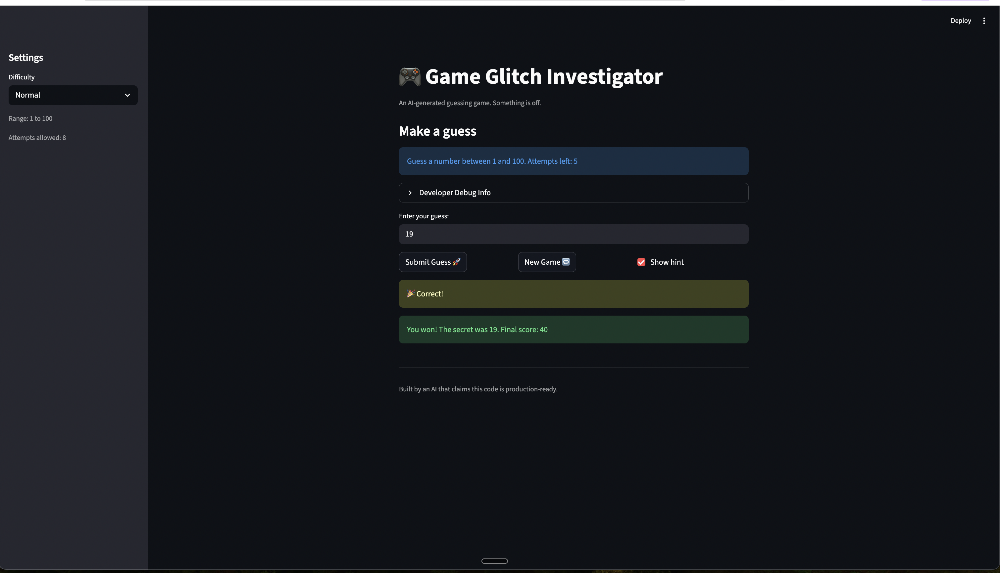

# 🎮 Game Glitch Investigator: The Impossible Guesser

## 🚨 The Situation

You asked an AI to build a simple "Number Guessing Game" using Streamlit.
It wrote the code, ran away, and now the game is unplayable. 

- You can't win.
- The hints lie to you.
- The secret number seems to have commitment issues.

## 🛠️ Setup

1. Install dependencies: `pip install -r requirements.txt`
2. Run the broken app: `python -m streamlit run app.py`

## 🕵️‍♂️ Your Mission

1. **Play the game.** Open the "Developer Debug Info" tab in the app to see the secret number. Try to win.
2. **Find the State Bug.** Why does the secret number change every time you click "Submit"? Ask ChatGPT: *"How do I keep a variable from resetting in Streamlit when I click a button?"*
3. **Fix the Logic.** The hints ("Higher/Lower") are wrong. Fix them.
4. **Refactor & Test.** - Move the logic into `logic_utils.py`.
   - Run `pytest` in your terminal.
   - Keep fixing until all tests pass!

## 📝 Document Your Experience

- [ ] Describe the game's purpose.
This app is a Streamlit number guessing game where the player tries to guess a hidden “secret” number within a limited number of attempts. After each guess, the game gives a hint telling the player to go higher or lower. The goal is to guess correctly before you run out of attempts.
- [ ] Detail which bugs you found.
The hint messages were incorrect (it would tell me to go lower even when the secret number was higher than my guess).
The game logic behaved inconsistently because the secret number was sometimes treated as a string instead of an integer, which broke comparisons.
“Hard” difficulty was not actually harder because its range was smaller than “Normal.”
After winning, the game would stop accepting new guesses unless a new game was started.
- [ ] Explain what fixes you applied.
Fixed the hint logic in check_guess so guess > secret returns Too High and tells the player to go LOWER, and guess < secret returns Too Low and tells the player to go HIGHER.
Removed the bug that converted the secret number to a string during certain attempts, so comparisons always work as numeric comparisons.
Updated Hard difficulty to use a larger range so it is actually harder than Normal.
Refactored core logic into logic_utils.py and added pytest regression tests to confirm the fixes and prevent the bugs from coming back.

## 📸 Demo

- [ ] [Insert a screenshot of your fixed, winning game here]

## 🚀 Stretch Features

- [ ] [If you choose to complete Challenge 4, insert a screenshot of your Enhanced Game UI here]
